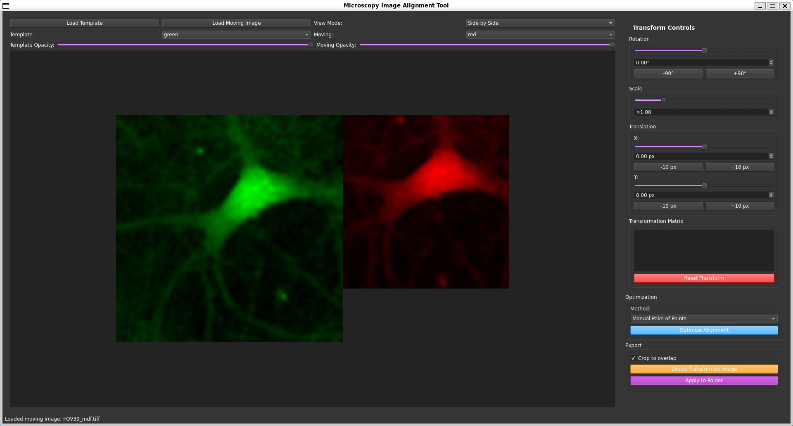
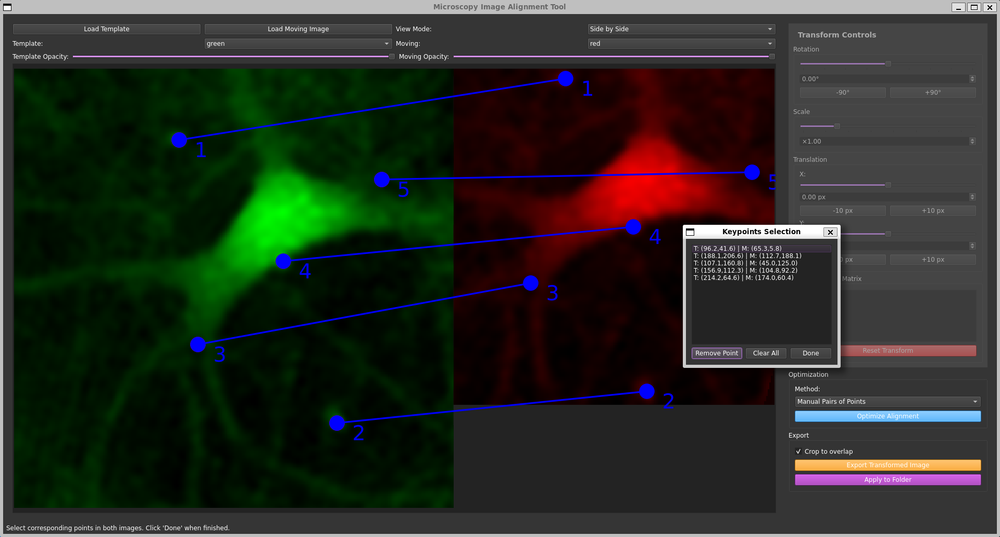
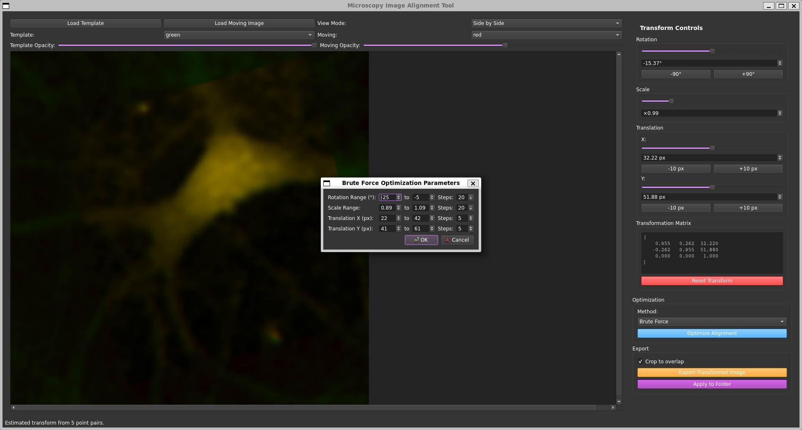

# MicroscopyAligner


<p align="center">
  
</p>

**MicroscopyAligner** is a cross-platform desktop application for manual and semi-automatic registration (alignment) of microscopy images. It provides an intuitive graphical interface for overlaying, transforming, and exporting aligned images, supporting a variety of scientific image formats (TIFF, PNG, JPG, NPY, etc.).

## Overview

- **Manual & Assisted Alignment:** Align images using manual keypoint selection, transformation controls, or automated optimization (phase correlation, brute force, enhanced correlation).
- **Rich Visualization:** Overlay or side-by-side display modes, customizable colormaps, and opacity controls for clear comparison.
- **Batch Processing:** Align and export multiple images in one go.
- **Support for Scientific Formats:** Handles TIFF, NPY, and holographic data formats for advanced microscopy workflows.
- **Export Options:** Save aligned images and transformation matrices for downstream analysis.

## Get Started

### Ready to go : 
Windows user, download the ```MicroscopyAligner.exe``` from dist folder and lanch the app ! 

### Build the app on you machine : 
#### Prerequisites
- Python 3.10+
- Conda or venv (recommended)
- [PySide6](https://pypi.org/project/PySide6/), [scikit-image](https://scikit-image.org/), [tifffile](https://pypi.org/project/tifffile/), [Pillow](https://pypi.org/project/Pillow/), [opencv-python](https://pypi.org/project/opencv-python/)

#### Installation

##### Using Conda (Recommended)
```bash
conda env create -f environment.yml
conda activate aligner
pip install -r requirements_txt.txt
```

##### Using venv
```bash
python -m venv .venv
source .venv/bin/activate
pip install -r requirements_txt.txt
```

#### Running the Application
```bash
python src/main.py
```

#### Building an Executable
Run the build script to create a standalone executable (see `build.py`).
```bash
python build.py
```
The executable will be located in the `build/dist/MicroscopyAligner` directory.

### Usage Example
1. **Load Images:** Click "Load Template" and "Load Moving Image" to select files.
2. **Adjust View** set your favorite colormaps, and view between "overlay" and "side-by-side".
3. **Adjust Alignment:** Use transformation controls or keypoint selection to align images. Or use "Manual pair of points" to select pairs of points, the transformation will we automatically calculated.
4. **Optimize:** Try automated alignment methods (phase correlation, brute force, enhanced correlation).
5. **Export:** Save the aligned image of batch process a folder

#### Batch Processing
Use the batch process feature to align multiple images at once. The current tranformation will be apply to all the images of a folder. 

### Screenshots

*Main interface of MicroscopyAligner showing image alignment workspace with template and moving image panels, transformation controls, and visualization options.*


*MicroscopyAligner during manual alignment, user can select pairs of points on template and moving images, Affine transform is calculated when "done" is pressed*


*MicroscopyAligner during brute force parametrization, user can choose ranges arround current values, a brute force algorithm then optimize the values on correlation*

## Who Maintains and Contributes
 
- **Maintainer:** [CSo]

Copyright (c) 2025 Corentin Soubeiran
SPDX-License-Identifier: MIT
<!-- - **Contributions:** See [`docs/CONTRIBUTING.md`](docs/CONTRIBUTING.md) for guidelines.
- **License:** See [`LICENSE`](LICENSE) for license details. -->

---

For questions, issues, or feature requests, please open an issue or contact the maintainer.
