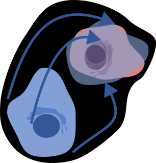
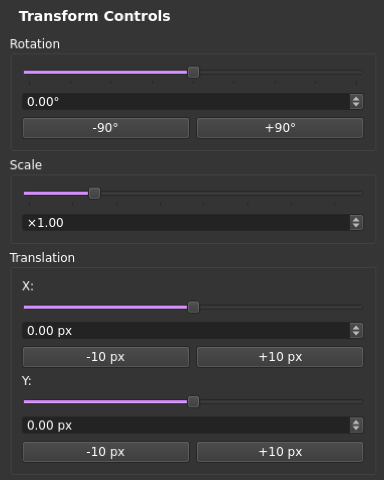
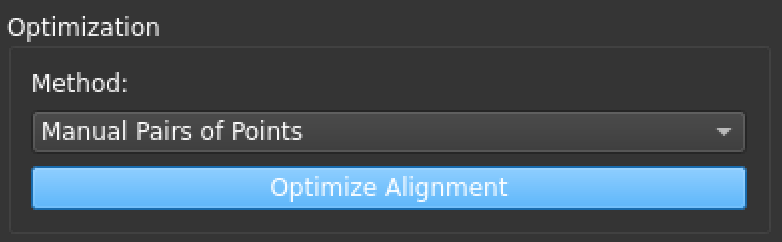
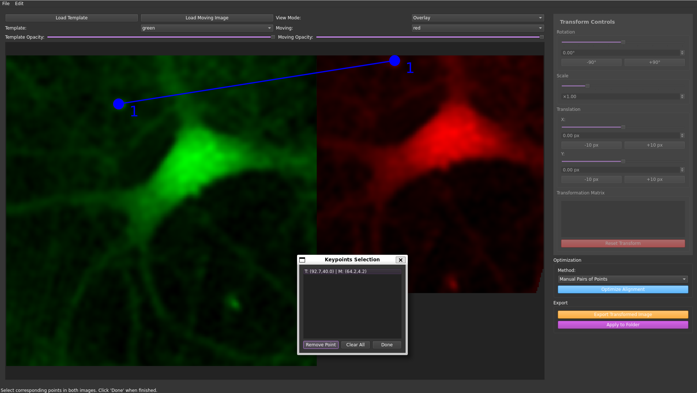
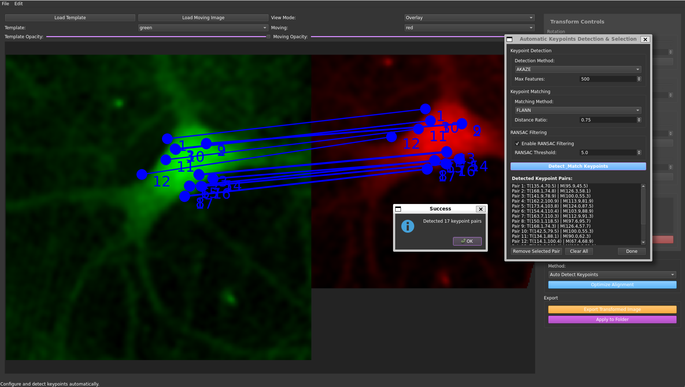
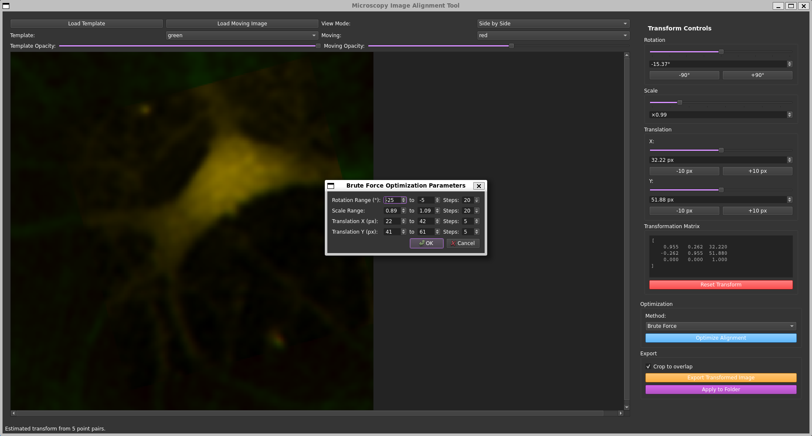
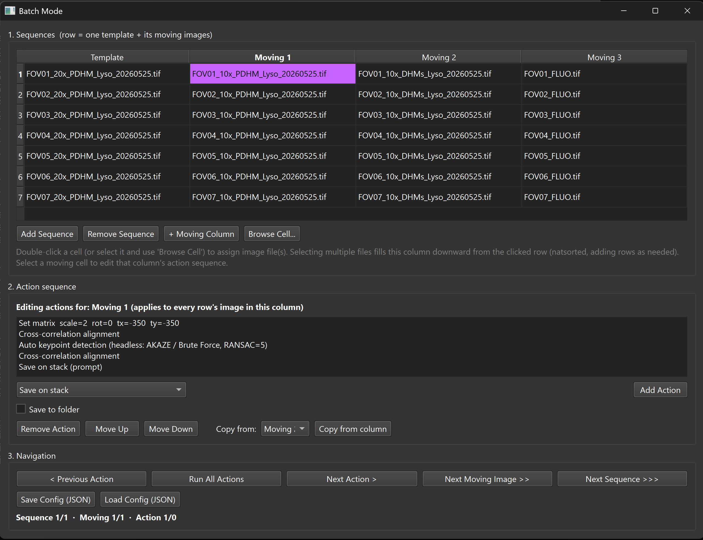
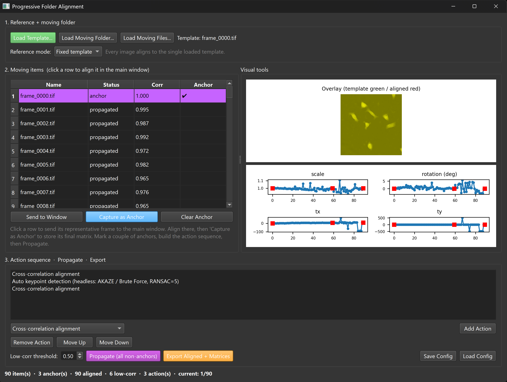
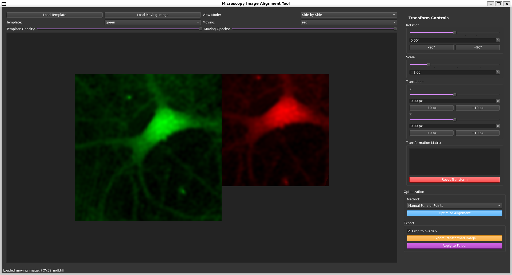
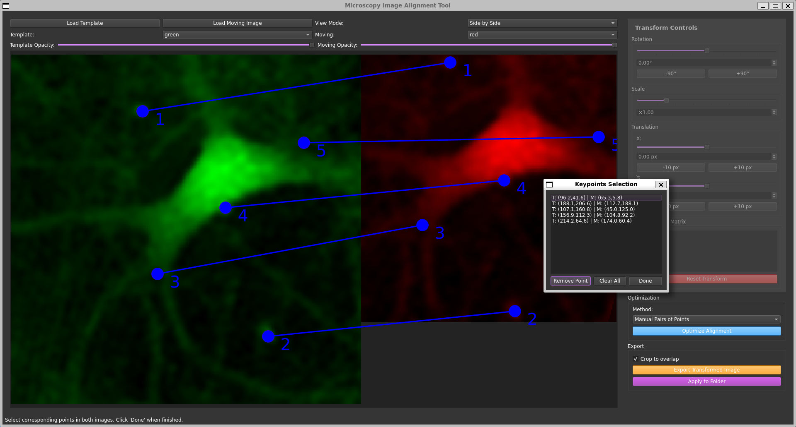

# MicroscopyAligner


<p align="center">
  
</p>

**MicroscopyAligner** is a cross-platform desktop application for manual and semi-automatic registration (alignment) of microscopy images. It provides an intuitive graphical interface for overlaying, transforming, and exporting aligned images, supporting a variety of scientific image formats (TIFF, PNG, JPG, NPY, etc.).

If you like it don't forget to "⭐" this repo ;)

## Table of Contents

- [Overview](#overview)
- [Get Started](#get-started)
  - [Ready to go](#ready-to-go)
  - [Build the app on your machine](#build-the-app-on-you-machine)
    - [Prerequisites](#prerequisites)
    - [Installation](#installation)
    - [Running the Application](#running-the-application)
    - [Building an Executable](#building-an-executable)
- [Features](#features)
  - [Manual Transform Editing](#manual-transform-editing)
  - [Automatic Alignment Features](#automatic-alignment-features)
    - [1. Manual Keypoint Alignment](#1-manual-keypoint-alignment)
    - [2. Automatic Keypoint Detection & Alignment](#2-automatic-keypoint-detection--alignment)
    - [3. Phase Cross-Correlation](#3-phase-cross-correlation)
    - [4. Brute Force Alignment for Fine Adjustment](#4-brute-force-alignment-for-fine-adjustment)
  - [Batch Processing](#batch-processing)
  - [Batch Processing Panel](#batch-processing-panel)
  - [Progressive Folder Alignment](#progressive-folder-alignment)
  - [Usage Example](#usage-example)
  - [Screenshots](#screenshots)
- [Who Maintains and Contributes](#who-maintains-and-contributes)
- [On going work and recent features](#on-going-work-and-recent-features)

## Overview

- **Manual & Assisted Alignment:** Align images using manual keypoint selection, transformation controls, or automated optimization (phase correlation, brute force, enhanced correlation).
- **Rich Visualization:** Overlay or side-by-side display modes, customizable colormaps, and opacity controls for clear comparison.
- **Batch Processing:** Align and export multiple images in one go — including a dedicated **Batch Processing Panel** that loads entire folders and replays user-defined sequences of actions per image.
- **Support for Scientific Formats:** Handles TIFF, NPY, and holographic data formats for advanced microscopy workflows.
- **Export Options:** Save aligned images and transformation matrices for downstream analysis.

## Get Started

### Ready to go : 
Windows user, download the ```MicroscopyAligner.exe``` from dist folder and lanch the app ! 

### Build the app on you machine : 
#### Prerequisites
- Python 3.10+
- Conda or venv (recommended)
- [PySide6](https://pypi.org/project/PySide6/), [scikit-image](https://scikit-image.org/), [tifffile](https://pypi.org/project/tifffile/), [Pillow](https://pypi.org/project/Pillow/), [opencv-python](https://pypi.org/project/opencv-python/)

#### Installation

##### Using Conda (Recommended)
```bash
conda env create -f environment.yml
conda activate aligner
pip install -r requirements_txt.txt
```

##### Using venv
```bash
python -m venv .venv
source .venv/bin/activate
pip install -r requirements_txt.txt
```

#### Running the Application
```bash
python src/main.py
```

#### Building an Executable
Run the build script to create a standalone executable (see `build.py`).
```bash
python build.py
```
The executable will be located in the `build/dist/MicroscopyAligner` directory.

## Features

### Manual Transform Editing


The application provides direct control over image transformations through an intuitive control panel:

- **Rotation:** Adjust rotation angle from -180° to +180° with fine control (0.1° steps) or quick ±90° buttons
- **Scale:** Modify uniform scaling from 0.25× to 4× to match image magnifications
- **Translation:** Fine-tune X and Y translation with pixel-level precision using sliders or quick ±10px buttons. Translation can also be adjusted by "click+drag" of the moving image.  

All transformations apply a **similarity transform** (translation + rotation + uniform scale) to the moving image. The transform is applied relative to the image center, preserving the image's aspect ratio. Changes are reflected in real-time in the overlay or side-by-side view.

**When to use:** Ideal for making fine adjustments after automatic alignment, or when you have a good initial estimate of the required transformation.

### Automatic Alignment Features


The optimization panel offers several methods to automatically compute or refine image alignment. Select your preferred method from the dropdown and click "Optimize Alignment".

#### **1. Manual Keypoint Alignment**


**Type of transform:** Affine (translation, rotation, scale, shear - 6 DOF) or Similarity depending on the number of points

**How it works:**
1. Switch to side-by-side view mode
2. Click corresponding points on both images (template first, then moving image)
3. Points are paired automatically, with blue markers and connecting lines indicating successful pairs
4. Click "Done" to compute the transformation

The transformation is estimated using:
- **1 point:** Translation only
- **2 points:** Similarity transform (translation + rotation + uniform scale)
- **3 points:** Affine transform (adds shear)
- **4+ points:** Robust affine transform using RANSAC to handle outliers

**Editing capability:** After clicking, points can be dragged to new positions. The old position is automatically cleared, and the transformation can be recalculated.

**Usage recommendations:**
- Use 3-4 well-distributed points for best results
- Select distinctive features that are clearly identifiable in both images
- Avoid points near image edges which may be affected by boundary artifacts
- Useful when images have distinct features but differ in rotation or scale

#### **2. Automatic Keypoint Detection & Alignment**

**Type of transform:** Affine (6 DOF) with RANSAC filtering for robustness

**How it works:**
1. **Keypoint Detection:** Detects distinctive features using computer vision algorithms (AKAZE, KAZE, SIFT, ORB, or BRISK)
2. **Feature Matching:** Matches detected keypoints between images using Brute Force or FLANN matchers with Lowe's ratio test
3. **RANSAC Filtering:** Removes outlier matches to retain only geometrically consistent point pairs
4. **Transform Estimation:** Computes robust affine transformation from filtered matches

**Parameters:**
- **Detection Method:** Choose based on image characteristics (AKAZE recommended for general use, SIFT for scale-invariant features)
- **Max Features:** Number of keypoints to detect (500 default, increase for complex images)
- **Matching Method:** Brute Force (accurate, slower) or FLANN (faster, approximate)
- **Distance Ratio:** Lowe's ratio test threshold (0.75 default, lower = stricter matching)
- **RANSAC Threshold:** Geometric consistency tolerance in pixels (5.0 default)

**Editing capability:** Detected point pairs can be removed from the list or individually adjusted by dragging points to correct positions. Lines connecting pairs update automatically.

**Usage recommendations:**
- Best for images with rich texture and distinctive features
- Start with AKAZE detector and default parameters
- If matching fails, try increasing max features or adjusting distance ratio
- Use after manual transform adjustment to refine alignment on the transformed image
- Particularly effective for images with repetitive structures where manual point selection is difficult

#### **3. Phase Cross-Correlation**

**Type of transform:** Translation only (2 DOF)

**How it works:**
Uses Fourier-domain phase correlation to find the optimal translation between images. The method:
1. Applies the current transformation (rotation, scale) to the moving image
2. Computes phase correlation in frequency domain with 10× subpixel accuracy
3. Updates only the translation parameters to maximize image overlap

**Usage recommendations:**
- **Ideal for:** Images that are already approximately aligned in rotation and scale
- Use after setting rotation and scale manually or with other methods
- Very fast and accurate for pure translation problems
- Does not handle rotation or scale differences - combine with manual adjustments first
- Works well with images having good contrast and distinct features
- Most effective when images have >50% overlap

#### **4. Brute Force Alignment for Fine Adjustment**

**Type of transform:** Similarity transform (4 DOF: rotation, scale, translation X, Y)

**How it works:**
Systematically tests all parameter combinations within user-defined ranges:
1. Define search ranges around current values for each parameter
2. Algorithm evaluates image correlation for each combination
3. Selects parameters yielding the highest correlation score

**Parameters configurable:**
- **Rotation range:** Min/max angles and number of steps to test
- **Scale range:** Min/max scaling factors and steps
- **Translation X/Y ranges:** Min/max pixel shifts and steps

Total evaluations = (rotation steps) × (scale steps) × (tx steps) × (ty steps)

**Usage recommendations:**
- **Best for final refinement** after coarse alignment is achieved
- Use narrow ranges (±5° rotation, ±0.1 scale, ±20px translation) for efficiency
- More steps = more accurate but slower (20 steps per parameter recommended)
- Can handle ~80,000 evaluations in reasonable time on typical hardware
- Excellent for small misalignments where other methods struggle
- Provides correlation score as quality metric

### Batch Processing
Use the batch process feature to align multiple images at once. The current tranformation will be apply to all the images of a folder. 

### Batch Processing Panel
*Avoid repeating file selection and treatment pipeline by loading entire folders and defining sequences of actions.*


*Batch processing pannel allow to define multiple template and moving images. By defining sequence of action it reduce repetitive operations/file loading while still keeping control via a direct feedback on the main window.*

Open via **File → Open Batch Mode Panel**. The panel is a separate window that drives the main alignment window: you describe many images and the steps you want to run on each, then step through the work (or run it in one shot).

**How it is laid out**

1. **Sequences table.** Each *row* is one "sequence": column 1 is a template image, columns 2..N are moving images. The **+ Moving Column** button adds more moving columns. **Double-clicking a cell opens a multi-file picker** — selected files are natsorted and fill that column downward from the clicked row, **auto-adding rows as needed**, so a whole folder of one condition lands in one click.
2. **Action sequence (per moving column).** Each moving column has its own ordered list of actions, shared across every row's image in that column. Supported actions: *set matrix values* (scale / rotation / tx / ty), *auto keypoint detection*, *cross-correlation*, *reset transform*, *save moving image*, *save on stack*. A **Copy from column** helper duplicates another column's sequence.
3. **Navigation.** *Previous Action* / *Next Action* step through the actions of the current moving image; *Run All Actions* runs the remainder in one shot; *Next Moving Image* and *Next Sequence* advance through the row and the table.

**Per-action options that let it run unattended**

- *Auto keypoint detection* — uncheck **Open dialog** to run **headlessly** with chosen detector (AKAZE / KAZE / SIFT / ORB / BRISK), matcher (Brute Force / FLANN) and RANSAC threshold.
- *Save moving image* / *Save on stack* — check **Save to folder**, pick a folder and (optionally) a suffix; the file is written directly as `<original_stem><suffix><ext>` without a dialog. *Save on stack* treats the row's moving cell as the input multi-frame stack.

**Persistence**

The transform is **kept** across moving images and rows (only an explicit *Reset* action clears it). The whole config — table contents and per-column action sequences with their options — is saved/loaded as JSON via **Save Config** / **Load Config**.

### Progressive Folder Alignment
*Align a sequence of files with progressive drift or movements.*

*Progressive alignement pannel allow to load moving sequences and define action for alignement allowing to correct cellular movement and drift during for instance long term imaging*

Open via **File → Open Progressive Folder Alignment**. This panel handles the case where each image in a folder needs a **different** transform — typical of acquisition drift across a time series — rather than one shared matrix as in basic Batch Processing.

**Workflow**

1. **Load** one template and a folder (or selection) of moving items, natsorted. Each item may be a flat image **or** a multi-frame ImageJ wavefront stack — stacks are auto-detected and exported through the existing stack pipeline.
2. **Click any row** in the moving-items list → its representative 2-D frame is sent to the main window, where you align it using any of the usual tools (manual transform, keypoints, cross-correlation, brute force, click+drag).
3. **Capture as Anchor** stores that image's final matrix as a known-good reference. Mark a few anchors spread across the sequence.
4. **Build an action sequence** (in the panel) listing the automatic steps you want replayed on every other image — for example `cross_correlation` then `auto_keypoints (headless)`. Same step-builder style as Batch Mode.
5. **Propagate** runs, for every non-anchor item:
   - a **prealignment** matrix obtained by linear interpolation between the two nearest anchor matrices by index (nearest-anchor copy outside the anchor range — no extrapolation),
   - then **replays the action sequence** on top to refine.

   Each result gets a correlation score against the template; anything below the configurable low-correlation threshold is flagged. Double-click a flagged row to fix it manually and re-capture.

6. **Export Aligned + Matrices** writes every warped item (`<name>_aligned.tif`, with stacks producing multi-frame aligned stacks) plus a `matrices.json` listing every per-image transform. **Save Config / Load Config** persists the template, item list, anchors, sequence and mode as JSON for later resumption.

**Reference modes**

A *Reference mode* selector switches between two strategies:

- **Fixed template** *(default)*: every image is aligned to the single loaded template. Use when the template stays visually close to every frame in the sequence.
- **Sliding (N − X)**: image N aligns to image N−X (its preceding reference). The per-image **relative** transforms are then composed into the first-image coordinate frame (`global[N] = global[N−X] @ rel[N]`) so the whole sequence still ends up in a common output frame. Use when the sequence drifts so much that the last frame looks nothing like the first — alignment stays well-conditioned because each pair of consecutive references is similar. The backward offset **X** is a spinbox (default 1 = previous image).

**Visual tools in the panel**

- Per-item *status* (`pending` / `anchor` / `propagated` / `low`) and correlation score.
- Thumbnail overlay (template green / aligned red) of the selected item against the global frame.
- A 2 × 2 plot of *scale*, *rotation*, *tx*, *ty* across the image index, with anchors marked — handy to spot outliers in the propagated transforms.
- Progress bar (cancelable) during propagation and export.

### Usage Example
1. **Load Images:** Click "Load Template" and "Load Moving Image" to select files.
2. **Adjust View** set your favorite colormaps, and view between "overlay" and "side-by-side".
3. **Adjust Alignment:** Use transformation controls or keypoint selection to align images. Or use "Manual pair of points" to select pairs of points, the transformation will we automatically calculated.
4. **Optimize:** Try automated alignment methods (phase correlation, brute force, enhanced correlation).
5. **Export:** Save the aligned image of batch process a folder

### Screenshots

*Main interface of MicroscopyAligner showing image alignment workspace with template and moving image panels, transformation controls, and visualization options.*


*MicroscopyAligner during manual alignment, user can select pairs of points on template and moving images, Affine transform is calculated when "done" is pressed*


*MicroscopyAligner during brute force parametrization, user can choose ranges arround current values, a brute force algorithm then optimize the values on correlation*

## Who Maintains and Contributes
 
- **Maintainer:** [CSo]

Copyright (c) 2025 Corentin Soubeiran
SPDX-License-Identifier: MIT
<!-- - **Contributions:** See [`docs/CONTRIBUTING.md`](docs/CONTRIBUTING.md) for guidelines.
- **License:** See [`LICENSE`](LICENSE) for license details. -->

---

For questions, issues, or feature requests, please open an issue or contact the maintainer.

## On going work and recent features
 
- [x] Add save and load transformation (CSo)
- [x] Add zoom and scroll option (CSo)
- [x] Add menu bar (CSo)
- [x] Add manual point editing by drag and drop (CSo)
- [x] Add automatic keypoints detection/matching/filtering including editing (CSo)
- [x] Add a pretransform managing the image centering for transformations (CSo)
- [x] Add a click+drag translation of moving image. 
- [x] Add Progressive Folder Alignment panel with fixed-template & sliding (N−X) reference modes (CSo)
- [x] Add Batch Processing Panel: per-column action sequences, multi-file column fill, headless auto-keypoints, folder save, Run All Actions (CSo)
- [ ] Add a preference file and option 
- [ ] Manage appearance depending on screen resolution 

